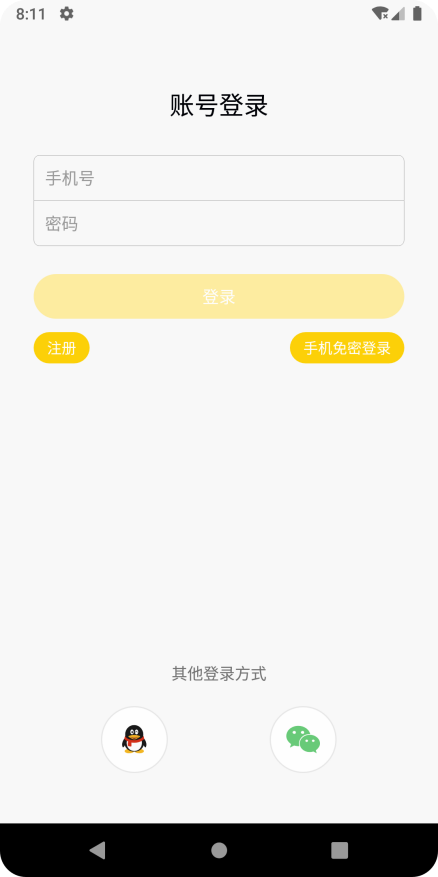
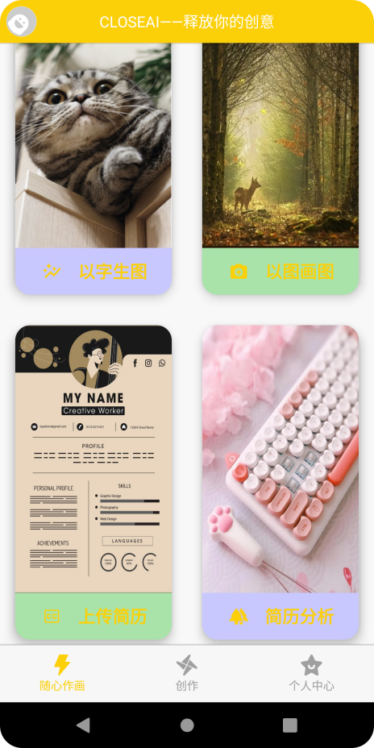

# 软件工程结课项目：基于Stable Diffusion的在线生图app

## 项目原地址

Front: https://gitee.com/N_E_E/ai-art-mobile

## 使用方法

#### 启动server

```bash
cd Server
```

使用IDEA打开Server项目，根据个人环境配置application.yml, 编译运行即可

#### 安装安卓端

```
cd Front
```

使用AndroidStudio打开`ai-art-mobile`，在`utils`中配置和后端对应的ip地址，编译运行

## 效果





